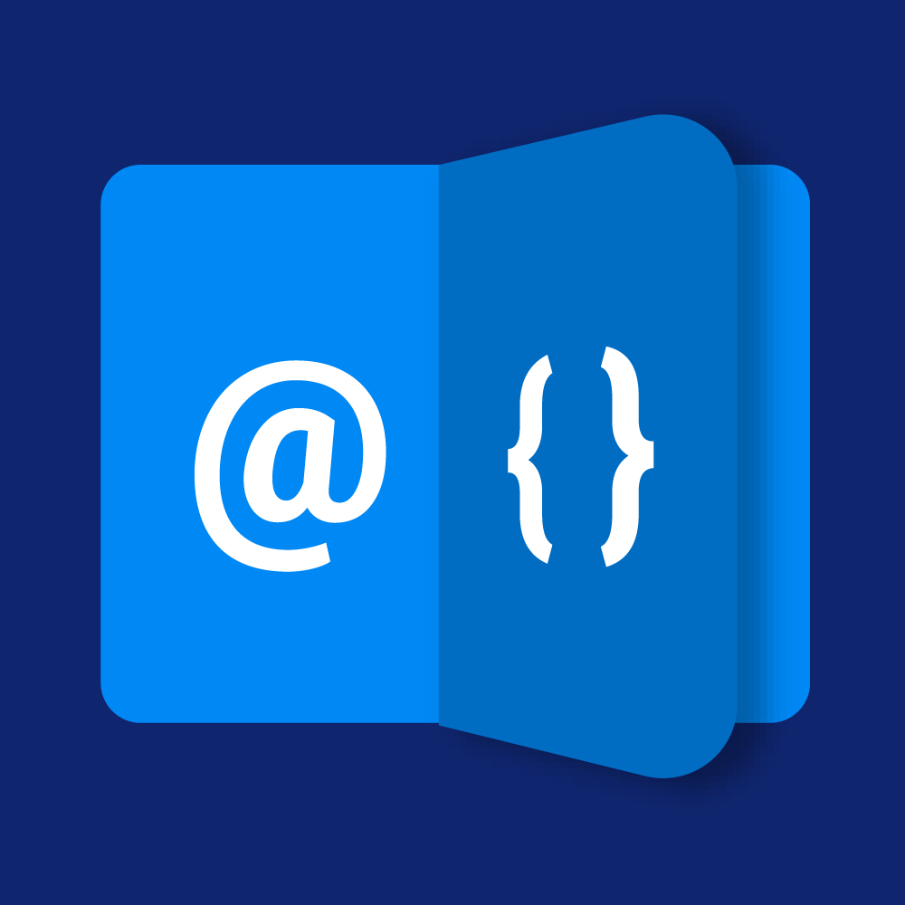

# Razor Tutorials for .net CMSs

> This is a [2sxc](https://2sxc.org) App for [DNN ☢️](https://www.dnnsoftware.com/) and [Oqtane 💧](https://www.oqtane.org/)

This is a tutorial for using Razor in DNN, and also helps you leverage additional APIs like

* DNN
* 2sxc
* Connect.Koi
* Razor Blade
* Image Resizer

You'll find a live, running copy of this tutorial on [2sxc.org/dnn-tutorials/razor](https://2sxc.org/dnn-tutorials/en/razor).

You can also download the latest copy of this App directly from the [releases](./releases) and install it in a DNN with 2sxc, to play around with the code yourself.

| Aspect              | Status | Comments or Version |
| ------------------- | :----: | ------------------- |
| 2sxc                | ✅    | requires 2sxc v12.05
| Dnn                 | ✅    | For v7, v8 and v9
| Oqtane 2            | ✅    | Requires v2.02
| No jQuery           | ✅    | 
| Live Demo           | ✅    | See [Dnn Razor Tutorial](https://2sxc.org/dnn-tutorials/en/razor)
| Install Checklist   | ➖    | <!-- See [Installation](https://azing.org/2sxc/r/Y2n1XQwq) on [azing.org](https://azing.org/2sxc) -->
| Source & License    | ✅    | included, ISC/MIT
| App Catalog         | ✅    | See [app catalog](https://2sxc.org/en/apps/app/dnn-razor-tutorial)
| Screenshots         | ✅    | See [app catalog](https://2sxc.org/en/apps/app/dnn-razor-tutorial)
| Best Practices      | ✅    | Uses v12.05 conventions
| Bootstrap 3         | ✔️    |
| Bootstrap 4         | ✅    |
| Bootstrap 5         | ✔️    | Works, but not optimized

## Contribute

Feel free to contribute to this app, please just coordinate it w/iJungleboy.

[//]: # (## Customize the App not needed, so commented out)

## History

* v12.05 2021-10
    * Upgraded everythnig to also run in Oqtane (except for Dnn specific examples)
    * Using the latest & greatest best-practices of 2sxc 12.05
* v12.11 2021-12
    * Added new tutorials for turnOn
* v13.01
    * Enabled data-optimizations
    * Improved home
    * Added tutorial navigation
    * Added Oqtane support
    * Added IScrub tutorials
* v14.07.05
    * Migrated the app to the 14.07 best practices
    * Changed the toolbar tutorials to also show the new IToolbarBuilder
    * Added a CmsContext tutorial